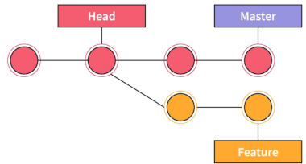

# ➕ Git: Et overordnet blikk

## ▶️ Systemet

Her ser vi strukturen Git-systemet bygger på. Man har

- **Working directory** (her kalt **TRE**)
- **Staging area** (her kalt **INDEKS**) og 
- **Git directory** (her kalt **REPO**):

<!--  -->

Dette korresponderer til de tre stadiene en fil under Git kan være i:

- Modifisert: Filen er endret, men ennå ikke sendt videre i Git-systemet
- Sendt til INDEKS: Filen er markert i sin nåværende versjon for å bli med i neste *commit*
- *Comitted*: Filen er trygt lagret i REPO-databasen

Arbeidskatalogen utgjør den aktive,lokale utgaven av filtreet til prosjektet. Filene er hentet ut fra REPO og plassert på disken klar for bruk eller videre modifisering.

INDEKS er rent fysisk en fil og holder oversikt over om hva som skal med i neste *commit*.

REPO inneholder objektdatabasen for prosjektet og lagrer alle versjoner, all historikk og alt av relasjoner gjennom prosjektet.

Både INDEKS og REPO opererer på fulle øyeblikksbilder av prosjektet, såkalte *snapshots* eller *commits*. INDEKS inneholder øyeblikksbildet for neste *commit*, mens REPO inneholder hele følgen av øyeblikksbilder, hele historikken, fra oppstart til tidspunktet for siste *commit*. Git lagrer selvsagt ikke hele filstrukturen i hver *commit*, men holder orden på endringer og sammenhenger for effektiv og plassbesparende utnyttelse.

<!--  -->

Her ser vi en illustrasjon av et i prosjekt organisert to grener, Master og Feature, som består av hhv. fire og to øyeblikksbilder. Sistnevnte gren er forgrenet ut fra hovedgrenens andre øyeblikksbilde.

Vi ser også noen andre viktige elementer i Git, nemlig:

- pekeren HEAD, som peker på aktivt øyeblikksbilde i treet, samt
- to gren-pekere (her kalt MAIN og FEATURE) som peker på de to grenene.

Vi kommer tilbake til hvordan disse egentlig er implementert og fungerer.

 Den grunnleggende arbeidsflyten er som følger:

1. Brukeren endrer eller oppretter filer i arbeidskatalogen
2. Brukeren velger hvilke forandringer som skal være med i neste *commit* ved å legge disse til INDEKS
3. Bruker gjør en *commit*, hvilket tar filene slik de er i INDEKS og lagrer alt (hele øyeblikksbildet) i REPO.

Ettersom prosjektet vokser, kan prosjektet grene ut i flere versjoner. Disse vil likevel være lagret i samme REPO. Alt av data, alt av historikk og referanser for å kunne gjenskape ulike versjoner i sin helhet, er lagret der. Vi kommer nærmere tilbake til detaljer her.

Vi bør i oppstarten også nevne at vi kan skjerme bestemte filer og kataloger fra Git ved å inkludere dem i en tekstfil **.gitignore** øverst i arbeidskatalogen. Avhengig av type prosjekt, kan man velge å ikke følge bestemt filer.


## ▶️ Grunnleggende eksempler

Før vi går inn på flere Git-detaljer og ser nærmere på hvordan ting egentlig henger sammen, kan vi vise noen grunnleggende eksempler og kommandoer for grunnleggende bruk. Dette dekker normal hovedaktivitet, og mange vil klare seg kun med dette. FlNoen kommandoer fins riktignok både i eldre og nyere varianter, og vi skal prøve å benytte de nyere. Vi ser her på lokal bruk, og vil snakke senere om hvordan man kan koble se seg på eksterne systemer som GitHub og andre, for backup, samarbeid eller fjernaksess.

### 🔸 Initialisering

Man kan initialiser Git for et prosjekt med å gjøre

```nginx
git init
```

på toppen av aktuelle arbeidskatalog. Ved første initialisering, for aller første prosjekt, oppgis navn og e-postadresse. Senere benyttes disse valgene automatisk.

Default *branch name* ved initialisering er *master* eller *main*, avhenging av distro. Ønsker man å spesifisere navnet nærmere, kan man benytte **`-b`**-opsjonen.

```html
git init -b <branch-navn>
```

### 🔸 Add

Man sender, enten en bestemt fil eller alle modifiserte filer, til INDEKS ved hhv.:

```r
git  add <fil>
```

```r
git  add -a
```

### 🔸 Status og log

Man kan til se hvilke filer som er *staged* og *modifisert* ved `git status`. Under ser vi noen varianter. Disse viser hhv. alle slike filer i en long output eller i kort output, samt branch-info:
filerfilerfiler
```nginx
git status
```

```nginx
git status -s
```

```nginx
git status -b <branch>
```

Vi kan få informasjon om øyeblikksbilder ved `gir log`. Her ser vi noen varianter som viser hhv. alle i et langt format, nyeste bilde, de to nyeste bildene, en kort, fargeformatert output samt en som viser et spesifiktbilde med utvidet informasjon om, bl.a. om fil-endringer.

```nginx
git log
```

```nginx
git log -1
```

```nginx
git log -2
```

```nginx
git log --oneline --graph --decorate --all
```

```nginx
git log <hash> --stat
```

### 🔸 Branch

Man kan lage en ny gren ved:


### 🔸 Commit

Mar foreta *commit* ved:

```nginx
git commit -m "<Passende beskrivelse>"
```

Evt. kan man sende alt til INDEKS og *commit* samtidig ved:

```nginx
git commit -a -m "<Beskrivelse>"
```

### 🔸 Help

Man kan få manualsider for ulike kommandoer i kort eller langt format (den første er for kort, de to andre gir samme, lange output):

```nginx
git <comand> -h
  ```

```nginx
git <comand> --help
  ```

```nginx
git help <comand>
```

Man kan også få en liste over alle kommandoer ved:

```nginx
git help -a
```

# ➕ Git: En detaljert kikk

For å forstå Git bedre og å kunne håndtere enkelte kommandoer riktig, trenger vi å dykke mer ned i detaljene. Vi må vite litt om hvordan et øyeblikksbilde egentlig ser ut og hvordan de ulike pekerne fungerer. Dessuten må se på hvordan man kan referere øyeblikksbilder i kommandoer. Dette er enkelt nok, og vi kan starte der.

##  ▶️ Hvordan referer øyeblikksbilder?

Man kan referer øyeblikksbilder både absolutt og relativt.

## ▶️ Innhold i øyeblikksbilde

Et øyeblikksbilde inneholder:

1. Tre-hash
2. Referanse til en eller flere forelderbilder
3. Metadata
   - Forfatter
   - Hvem som utførte *commit*
   - Tidsstempl
   - *Commit*-melding
4. Commit-hash

Den vanskeligste å forklare her er tre-hashen, så vi tar den til slutt. De øvrige er relativt selvforklarende. Normalt her et øyeblikksbilde bare ett forelderbilde, men ifm. sammenfletting av grener (*merge*), er flere foreldre involvert. Metadataene trenger ingen forklaring, og man kan også se disse dataene for ett bilde ved:

```html
git cat-file -p <commit-hash>
```

*Commit*-hash er hash-verdien av hele denne datastrukturen.

Så hva da med tre-hashen? Kort fortalt er den hash av en binærrepresentasjon av *commit*-treet (den som man illustrativt kan tenke på som et tegnet nodenettverk med en eller flere forgreninger), altså en referanse til binærrepresentasjonen. Men i denne representasjonen inngår også referanser til binærutgaver av filene, lagret som såkalte BLOBs (binary large objects). Referanser er gjerne hashede-verdier, slik kan Git kan holde oversikt over filtrær og innhold, oppdage endringer og gjøre nye nye hash-beregninger etter behov. Trær og blobs gjenbrukes, og Git operer effektivt både mht til ytelse og lagringsmessig.

Det er selvsagt mulig å grave enda dypere i dette, men dette holder trolig for vårt formål.


## ▶️ HEAD og gren-pekere

Vi må se litt nærmere på hvordan peker HEAD og gren-pekere er implementert og virker. Vi husker at HEAD (konseptuelt) peker på aktivt øyeblikksbilde, mens gren-pekere peker (konseptuelt) på hver sin gren. Begge deler er egentlig vanlige tekstfiler. HEAD ligger på `.git`, mens de sistnevnt har grennavn som filnavn (én fil for hver gren) og ligger på `.git/refs/heads`.

En grenpeker, som f.eks. MAIN, inneholder hash-verdien til et øyeblikksbilde (normalt siste øyeblikksbilde på grenen), som f.eks:

```yaml
436ab61d81d052cd320f3a8a4dc532f33e5d1a13
```

HEAD, på sin side, inneholder (i normal tilstand) referanse til en gren, i form av sti/filnavn til en grenpeker, f.eks.

```yaml
ref: refs/heads/main
```

I noen tilfeller (som vi skal se) inneholder den imidlertid bare hash-verdien til et bestemt øyeblikksbilde. HEAD sises da å være *detached* eller i *detached* tilstand, hvilket er utnyttes av enkelt kommandoer.

Men i normaltilstand, når man sier "HEAD peker på øyeblikksbilde D", så betyr det egentlig at HEAD peker på MAIN som i sin tur peker på bilde D:

```yaml
HEAD → MAIN → D
```

**SITAT**  
En commit inneholder snapshot av prosjektet og referanser til foreldre.
Hele commit-grafen kan rekonstrueres ved å følge parent-referansene bakover.


## ▶️ Add

Vi har sett på de vanligste kommandoen, som `add`, i [Grunnleggende eksempler](##-▶️-Grunnleggende-eksempler). Men vi kan nå forklare mer detaljert hva som skjer og ikke skjer ifm. `git add`, `git commit` og (særlig) andre kommandoer. Det vi ønsker å se, er se hva som endres av TRE, INDEKS, REPO, HEAD og gren-pekere. I kommandoer som bare involvere én gren, antar vi da at denne er MAIN.

Man sender altså filer til INDEKS (*staging*) ved 

```r
git  add <fil>
git  add -a
```

Dette påvirker ikke REPO, HEAD, eller grenpeker, men et øyeblikksbilde av TRE sendes til INDEKS, hvilket vi kan illustrere ved:

```yaml
add:
    TRE → INDEKS
```

Dermed har man en presis oversikt over hvordan kommandoen virker (hvilket blir viktigere for andre kommandoer).


## ▶️ Commit

Vi kan foreta *commit* med en passende beskrivelse, ved

```bash
git commit -m "First commit of prosjekt git-TEST."
```

```yaml
[Branch-NO-1 (root-commit) 57f8ab9] First commit of prosjekt git-TEST.
 5 files changed, 215 insertions(+)
 create mode 100644 doc.md
 create mode 100644 git.png
 create mode 100644 kap-1.adoc
 create mode 100644 kap-2.adoc
 create mode 100644 kap-3.md
 ```

Dette legger øyeblikksbildet på INDEKS over i følgen av øyeblikksbilder på REPO, og HEAD oppdateres til å peke på dette. Endringene på Git-systemet kan illustreres ved:

```yaml
commit: INDEKS → REPO, HEAD++
```

Mer informasjon over alle øyeblikksbilder på REPO fås (i lang versjon) ved:

```nginx
git log
```

```yaml
commit 57f8ab9901e13b03f5074bef52fb4e66d7bfb391 (HEAD -> Branch-NO-1)
Author: Jan Roger Sandbakken <mailjaro@gmail.com>
Date:   Thu Feb 5 19:16:43 2026 +0100

    First commit of prosjekt git-TEST.

…/git-TEST on 🌿 Branch-NO-1 [!] 
```

Evt gir følgende et fargeformatert konsentrat (kortversjon) får ved:

```r
git log --oneline --graph --decorate --all
```

Hash-verdien vi ser (oftest en SHA-1--hash, men i noen tilfeller også SHA-256) beregnes av filer og kataloger i øyeblikksbilde, av tidligere øyeblikksbilder, forfatter og *commit*-melding. Hashen benyttes både som en unik identifikator og for integritetskontroll (av hele historikken). En kortversjon av hash-en (minimum de fire første tegnede, ofte de syv første) benyttes ofte til å referere øyeblikksbilder på REPO.

Man kan også legge til INDEKS og foreta *commit* av *alle* modifiserte filer i en og samme kommando ved:

```nginx
git commit -a -m "First commit of prosjekt git-TEST."
```


## ▶️ Rename

For å endre navnet til en fil, kan man gjøre:

```html
git mv <fil> <ny-fil>
```

Navnet endres på arbeidskatalogen, og endringen legges til på INDEKS, klar for neste *commit*.

Alternativt kan man navnendre filen og legge den til indeksen selv. Altså gjøre:

```html
mv <filnavn> <nytt-fil-navn>
git <ny-fil>
```

Kun dette blir endret:

```yaml
rename: TRE → INDEKS
```

så alt er klargjort for en oppfølgende *commit*.


## ▶️ Delete

For å slette en fil kan man gjøre

```bash
git rm <fil>
```

Dette krever at filen er *commited*. Kommandoen gjør to ting samtidig:

- Fjerner filen fra arbeidskatalogen
- Legger inn endringen på INDEKS 

Man kan for så vidt også slette filen fra arbeidskatalogen (ved `rm`) og legge til INDEKS selv (ved `add`), med samme resultat.

Dersom man ønsker å beholde filen lokalt, men bare fjerne den fra Git, kan man dessuten gjøre

```bash
git rm --cached <fil>
```

(og deretter også oppdatere **.gitignore** tilsvarende).

Kun INDEKS blir endret

```yaml
delete: TRE → INDEKS
```

Prosessen krever en avsluttende *commit*.


## ▶️ Reset

`reset` er en kommando med rike muligheter til å endre tingenes tilstand i pekere, i TRE og INDEKS. Vi har tre grunnleggende versjoner (med flere mulige opsjoner):


```yaml
- Soft reset:  Endrer HEAD

- Mixed reset: Endrer HEAD         INDEKS ← REPO

- HARD reset:  Endrer HEAD   TRE ← INDEKS ← REPO
```

Ved *hard reset* kan man dessuten benytte opsjonene `--Merged` og `--Keep`, som på to måterbeskytter filer i TRE fra overskrivelse.

La oss se nærmere hva som skjer også med pekerne våre ved *reset*.

Anta vi har en følge av øyeblikksbilder A → B → C → D på MAIN, og at D er aktivt. Hva skjer om vi foretar:

```nginx
git reset soft <B>
```

Hele prosessen kan oppsummeres ved:

```yaml
HEAD → MAIN → B
```

Dvs. MAIN peker på øyeblikksbilde B, og HEAD peker på gren MAIN. Dette gjør B aktivt. Ved *soft reset* endres verken TRE eller INDEKS (slik at disse i utgangspunktet fortsatt har verdi D). REPO er uansett uforandret.

Merk nå at dersom vi commit'er modifiseringer, får vi en etterfølger vi kan betegn C' som vil være ulik C (uansett om modifiseringene skulle være identiske). C og D risikerer nå å bli hengende (selv om forgjenger B er uendret). Dersom intet annet refererer dem, en tag eller noe, risikerer disse (med tid og studer, kanskje etter 30 dager) å bli slettet av *garbage collector* (GC). Disse risikerer å bli såkalt *unreachable*.

Dette betyr at *reset* primært er ment for å rulle tilbake i versjoner, kanskje angre en *commit* ved feilskrevet melding etc. Lite endres direkte (særlig ved *soft reset*), men etterfølgende modifisering vil endre historikken og gjøre kommandoene nokså gjennomgripende like fullt.

La oss nå se på den beslektede kommandoen `switch`.


## ▶️ Switch

Som vi har sett, kan `switch` benyttes til å bytte gren. Men vi kan også hoppe til et hvilket som helst øyeblikksbilde, slik som *reset*.

La oss anta samme utgangspunkt som over: A → B → C → D på MAIN, og D er aktivt. Hva skjer om vi hopper til B ved `switch`?

```nginx
git switch --detached <B>
```

(detached er påkrevet når man hopper innen samme gren.) Her er virkningen oppsummert:


```yaml
HEAD → B
WD ← INDEKS ← B
```

HEAD blir satt til å peke på øyeblikksbilde B (dvs. det vil inneholde hash-verdien til B, ikke lenger referanse til en gren). MAIN endres ikke og peker fortsatt på D (siste commit i gren MAIN), og REPO forblir også uforandret. B blir aktivt også i dette eksempelet, men merk at D (og dermed også historikken fram) fortsatt er *reachable* her.

## ▶️ Checkout

## ▶️ Restore

## ▶️ Merge

## ▶️ Merging

Som antydet, kan man lage én eller flere forgreninger fra et øyeblikksbilde. Kommandoen er slik:

```html
git branch <ny gren>
```

Dette oppretter en peker (egentlig fil, se nedenfor) med dette navnet, og denne grenen og dette øyeblikksbildet blir aktivt.

Vi kan liste alle grener ved:

```nginx
git branch
```

Man kan bytte gren ved

```nginx
git switch <gren>
```

Vi skal behandle denne kommandoen nærmere, men her blir <gren> aktiv gren, og siste *commit* på denne aktivt øyeblikksbilde. I tillegg oppdateres både arbeidskatalog og INDEKS iht. til dette. Dette kan oppsummeres ved:

```yaml
switch:
HEAD → <gren> → latest commit
TRE ← INDEKS ← REPO
```


## ▶️ Rebase

## ▶️ *Restore og Unstage (Endres)

Ettersom vi har sett på *add* og *commit*, er det naturlig også å se på hvordan disse aksjonene kan reverseres. Altså, hvordan foreta *unstage* av en fil på INDEKS eller gjenskape (*restore*) en *commited* fil? For å forklare det, må vi se nærmere på noen detaljer.

INDEKS inneholder alltid snapshot av neste *commit*. Men merk at den ikke nulles eller endres ved en *commit*. INDEKS endres bare dynamisk ved nye *add*. La oss derfor følge en bestemt fil **kap-1.adoc** gjennom Git-systemet. Anta at filen først har innhold (med plassering, fil-attributter osv.) som kan oppsummeres med 'innhold **A**'.

- Når vi legger filen til INDEKS og utfører *commit*, ser alle (TRE, INDEKS og REPO) innhold **A**.

- Om filen modifiseres til **B**, ser TRE innhold **B**, mens INDEKS og REPO ser innhold **A**.

- Om filen legges til INDEKS, ser TRE og INDEKS innhold **B**, mens REPO ser innhold **A**.

- Om man utfører *commit*, ser alle tre innhold **B**.

Ved innfører følgende notasjon 

```yaml
TRE:      arbeidskatalog
INDEKS:  staging area
REPO:    .git directory
```

kan dette kortere illustreres ved:

```yaml
add:     TRE → INDEKS
commit:  INDEKS → REPO
```

### 🔸 Restore

Kommandoen for å gjøre *restore* av en fil er:

```nginx
git restore kap-1.adoc
```

Merk at `restore` gjenskaper filer på TRE fra INDEKS. Som vi har sett, *kan* disse være — men trenger ikke å være — like filene på REPO.

Dette kan kortere illustreres ved:

```yaml
restore:  TRE ← INDEKS
```
Ønsker man å utføre *restore* på hele øyeblikksbildet, kan man gjøre:

```nginx
git restore
```

Dette kopierer tilsvarende hele øyeblikksbilde over i INDEKS.

Dersom man ønsker å gjøre en *restore* fra et tidligere tilstand, får man til det ved å referere til aktuelt øyeblikksbilde

```bash
git restore source=<commit> kap-1.adoc
git restore source=<commit> 
```

for enkeltfiler eller øyeblikksbilde. Vi kommer tilbake til hvordan øyeblikksbilder refereres.


### 🔸 Unstage

*Unstage* av en fil, fjerning av fil fra INDEKS, foretas med:

```nginx
git restore --staged kap-1.adoc
```

For å fjerne hele øyeblikksbildet på INDEKS, gjør:

```nginx
git restore --staged
```

Ved en *unstage* kopieres fil/øyeblikksbilde fra REPO over i INDEKS. Virkningen av siste *add* blir dermed kansellert. Merk da at filer i arbeidskatalog ikke berøres av dette. Det blir opp til brukeren å bestemme hva han videre gjør med disse.

En *unstage* kan altså illustreres ved.

```yaml
unstage:  INDEKS ← REPO
```

Det er nyeste øyeblikksbildet som legges til grunn her (eller egentlig øyeblikksbildet pekeren HEAD peker på). Om man ønsker *unstage* fra tidligere *commit* (eller eller mer presist en bestemt *commit*), kan man gjøre:

```bash
git restore --staged --source=<commit> kap-1.adoc
git restore --staged --source=<commit> 
```

Vi kommer tilbake til hvordan man refererer tidligere øyeblikksbilder senere.


## ▶️ *Reset og checkout (endres)

Man kan også hente inn fil eller øyeblikksbilde fra REPO helt over i TREen. Da skjer egentlig først en *unstage* og så en *restore*, altså operasjonen:

```yaml
reset      : TRE ← INDEKS ← REPO
```

Dette kan samles i en og samme kommando ved:

```r
git restore --staged --worktree kap-1.adoc
git restore --staged --worktree 
```

for fil eller *commit*. Dette gjenskaper tidligere REParbeidskatalogO-lagret fil eller øyeblikksbilde. Merk for det første at, uten nærmere angivelse, er det siste *commit* som legges til grunn her (eller egentlig *commit* utpekt av HEAD). For det andre, når vi gjenskaper en enkeltfil, har man ingen garanti for at den gjenskapte (gamle) filen lenger gir mening i (den nyere) arbeidskatalogen. Brukeren har likevel lov å gjøre dette. Alt ansvar for mening og konsistens overlates brukeren.

En gjenskaping kalles også en *checkout* eller en *reset*. Følgende kommandoer utfører derfor essensielt det samme (med hensyn til hva de gjenskaper i arbeidskatalogen):

```r
git checkout -- kap-1.adoc
git checkout
```

for fil eller øyeblikksbilde.

*Reset* kan ikke gjøres på enkeltfiler, men man kan reset'e siste øyeblikksbilde:

```nginx
git reset --hard
```

Ønsker man å foreta *checkout*/*reset* for et tidligere (eller egentlig spesielt) øyeblikksbilde, må man referere ønsket *commit*:

```html
git checkout <commit> -- fil.txt
git checkout <commit>
git reset --hard <commit>
```

**Merk**: Som antydet er det likevel subtile forskjeller mellom en gjenskaping via `restore --staged` og en via *checkout*/*reset*. Det har å gjøre med hva statusen blir på REPO i etterkant. REPO har nemlig en peker **HEAD** som hele tiden peker på aktivt øyeblikksbilde. Normalt samsvarer dette til nyeste øyeblikksbilde, men når man begynner å gjenskape filer og øyeblikksbilder, er det et spørsmål om hva som nå skal bli aktivt øyeblikksbilde. Ved bruk av *checkout* og *reset* er tanken at man ønsker å bla tilbake til en eldre versjon, og HEAD endres til å peke på det refererte øyeblikksbildet. Ved bruk av `restore --staged` ser man heller for seg at bruker skal gjøre en større editeringsjobb før en ny *commit*, uten å blande inn nye versjoner og en spesiell historikk.

Oppsummert kan vi si:

```yaml
unstage    : HEAD flyttes ikke
restore    : HEAD flyttes ikke
checkout   : HEAD flyttes
reset      : HEAD flyttes
```

Forskjellen har en viktig relevans for hva som skjer videre etter modifiseringer og ny *commit*. Når man foretar en *checkout* eller *reset* fra tidligere *commit* igjen, flyttes nemlig HEAD bakover til aktuelt øyeblikksbilde. Foretas ny commit, vil man få et nytt etterfølgende øyeblikksbilde, og de tidligere etterfølgerne blir hengende fritt. Kanskje ønsket bruker å rulle tilbake til tidligere tilstand og forkaste alle etterfølgere. Men hvis ikke, står de hengende øyeblikksbildene i fare for å bli slettet av *garbage collector*. Normalt tar dette 3-6 uker, og fram til da er øyeblikksbildene og nødvendige referanser likevel ikke tapt.

## ▶️ *Branching (Endres og flyttes)

Det anbefales å gjøre hyppige *commits*. Av og til ønsker man å dele ut en ny fran av prosjektet. Kanskje ønsker man å eksperimenter med noe, ny funksjonalitet, en omskriving etc. Det er lett å lage en ny gren (*branch*). Det er også lett å bytte (*switche*) tilbake til hovedgrenen eller mellom grener.

Det er flere alternative kommandoer her, men følgende oppretter ny gren **Branch-NO-2** (med forgrening ut fra *commit* som HEAD pekte på før kallet):

```cpp
git switch -c branch-1
```

```yaml
Switched to a new branch 'Branch-NO-2'
```

```nginx
git status
```

```yaml
On branch Branch-NO-2
nothing to commit, working tree clean
```

Her kan man lage nye følger av *commits*, f eks. et par navnendringer:

```css
git mv A.adoc AA.adoc; git commit -m "Første commit på gren 2."
git mv B.adoc BB.adoc; git commit -m "Andre commit på gren 2."
```

Slik lister man grener:

```nginx
git branch
```

```yaml
Branch-NO-1
Branch-NO-2
```

Arbeidskatalogen vår er:

```bash
ls -1
```

```yaml
AA.adoc
BB.adoc
git.png
kap-3.md
```

Vi kan bytte tilbake til **Branch-NO-1** ved:

```nginx
git switch Branch-NO-1
```

```yaml
Switched to branch 'Branch-NO-1'
```

```bash
ls -1
```

```yaml
A.adoc
B.adoc
git.png
kap-3.md
```

Ved tilsvarende kommando kan vi også bytte til **Branch-NO-2**.

```nginx
git switch Branch-NO-1
```

Situasjonen nå er følgende:

```nginx
git log --oneline
```

```yaml
082fecc (HEAD -> Branch-NO-2) Andre commit på gren 2. Nok en navnendring
7627a6c Første commit på gren 2, en navnendring av A.adoc.
444f3ee (Branch-NO-1) Ny navnekonvensjon implementert
d52c4d9 Doc.md er fjernet fra prosjektet.
8dae426 Doc.md er editert en del.
57f8ab9 First commit of prosjekt git-TEST.
```

Vi ser at HEAD peker på nyeste av to *commits* i gren 2. Gren 1 inneholder fire *commits*.

Vi kan referer de enkelte øyeblikksbildene på flere måter. Kortversjonen av hash-verdien

## ▶️ Archive


## ▶️ *Oppsummering

Endres. Må ha med HEAD og gren-peker

```yaml
add        : INDEKS  ←  TRE
commit     : REPO    ←  INDEKS
restore    : TRE     ←  INDEKS
unstage    : INDEKS  ←  REPO
reset      : TRE     ←  INDEKS ← REPO
```

Merk at disse Git-kommandoene ikke hopper over ledd i følgen:

```yaml
INDEKS  ↔  TRE  ↔  REPO
```

## ▶️ Nettressurser

[Pro Git Book](https://git-scm.com/book/en/v2)

[Git in VSCode](https://code.visualstudio.com/docs/sourcecontrol/overview)

# ➕ GitHub