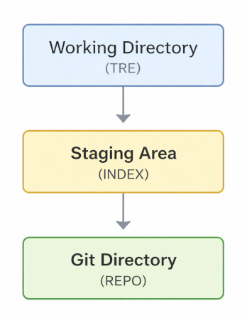

# 📗 En introduksjon til Git

Dette heftet gir en introduksjon til Git. Den viser grunnleggende eksempler og bruk i del 1, og går litt mer i dybden på implementering og detaljer i del 2.

Heftet retter seg mot brukere med ikke altfor avanserte behov, men som likevel ønsker trygghet og forståelse i det man gjør. Det retter seg ikke mot kodere eller større samarbeidsprosjekter, men heller mot folk som skriver, dokumenterer eller koder mer hobbypreget.

❗ I et prosjekt med flere deltakere bør man sikkert sørge for god opplæring for å unngå å påføre andre unødvendige versjonskonflikter eller sogar tap av arbeid.

Å kunne jobbe sømløst på flere PC-er, ha et enkelt system for ekstern backup, kunne eksperimentere med ulike versjoner med full oversikt, er likevel viktig. Og Git kan forenkle hverdagen for slike brukere vesentlig. Mange er de som brukt mye energi på å holde orden på backuper og ulike versjoner på hjemmesnekret vis. Dette heftet forsøker å være til hjelp for slike brukere.

Heftet tar bl.a. for seg hvordan man setter opp forbindelser mot [GitHub](https://github.com/) (for ekstern overførsel) fra en eller flere PC-er. Linux legges til grunn som operativsystem.

Det fins gode alternativer til GitHub der ute (med ulike karakteristika), som f.eks.

- [GitLab](https://about.gitlab.com/)
- [Bitbucket](https://gitbucket.github.io/)
- [Gitea](https://about.gitea.com/)
- [Gogs](https://gogs.io)
- [SourceHut](https://git.sr.ht/)
- [Azure DevOps Repos](https://azure.microsoft.com)

og sikkert andre. Men GitHub er mest utbredt og fungerer fint for oss.

Ulike Git-kommandoer blir vist og forklart. Det kan likevel være lurt å benytte en editor som [Visual Code Studio](https://code.visualstudio.com/). Git aksesseres der via et menybasert grensesnitt, og visse operasjoner, særlig det å angre ting, er enklere der. Det er uansett nyttig å ha en god forståelse i bunn. Og har man det, er jobbing med systemer som Git på Visual Code Studio enkelt (og vil ikke bli behandlet spesielt).

Det kan også nevnes at Git har et et godt, gjennomtenkt design. Filosofien er at alt skal kunne gjenskapes og at intet permanent skal gå tapt. Som det ofte sies:

-- *If it’s hard to do something stupid, the design is good.*

```text
   ____ _ _   
  / ___(_) |_ 
 | |  _| | __|
 | |_| | | |_ 
  \____|_|\__|
```

---

## 📕 Systemet

Her ser vi strukturen Git-systemet bygger på:



Man har

- **Working directory** (her kalt **TRE**)
- **Staging area** (her kalt **INDEKS**) og
- **Git directory** (her kalt **REPO**)

Ved bruk av et fjernsystem som GitHub, kommer et fjerde element inn i tillegg (behandles senere i dokumentet). De tre elementene korresponderer til de tre hovedstadiene en fil kan være i under Git:

- Modifisert: Filen er endret, men ennå ikke sendt videre i Git-systemet
- Sendt til INDEKS: Filen er markert i sin nåværende versjon for å bli med i neste *commit*
- *Comitted*: Filen er trygt lagret i REPO-databasen

Arbeidskatalogen utgjør den aktive, lokale utgaven av filtreet til prosjektet. Filene er hentet ut fra REPO og plassert på disken klar for bruk eller videre modifisering.

INDEKS holder oversikt over om hva som skal med i neste *commit*.

REPO inneholder objektdatabasen for prosjektet og lagrer alle versjoner og alt av relasjoner gjennom prosjektet.

Både INDEKS og REPO opererer på fulle øyeblikksbilder av prosjektet, såkalte *snapshots* eller *commits*. INDEKS inneholder øyeblikksbildet for neste *commit*, mens REPO inneholder hele følgen av øyeblikksbilder fra oppstart til siste *commit*. Git lagrer selvsagt ikke hele filstrukturen i hver *commit*, men holder orden på endringer og sammenhenger for effektiv og plassbesparende utnyttelse.

```text
A---B---C---D---E  ← MAIN
         \
          F---G---H  ← FEATURE
                         ↑
                        HEAD
```

Her ser vi en illustrasjon av et prosjekt organisert i to grener av øyeblikksbilder. Hvert øyeblikksbilde har referanse bakover til sin forelder, men aldri til sine barn. I figuren skjer commits fra venstre mot høyre, slik at f.eks. F og D har referanse til C (men ikke omvendt), og C har referanse til B (men ikke omvendt).

Vi ser også andre viktige elementer i Git, nemlig:

- pekeren HEAD, som indirekte peker på aktivt øyeblikksbilde, samt
- to gren-pekere (her kalt MAIN og FEATURE) som peker på de to grenene.

Vi kommer tilbake til hvordan disse egentlig er implementert.

 Den grunnleggende arbeidsflyten er som følger:

1. Brukeren endrer eller oppretter filer i arbeidskatalogen
2. Brukeren velger hvilke forandringer som skal være med i neste *commit* (legger disse til INDEKS)
3. Bruker gjør en *commit*, hvilket tar filene slik de er i INDEKS og lagrer alt (hele øyeblikksbildet) i REPO

Ved ekstern versjonskontroll foretar man typisk et innledende `git pull` (for hente inn nyeste tre fra ekstern REPO) og et avsluttende `git push` (for å *synce* lokalt REPO med ekstern REPO) i tillegg.

Ettersom prosjektet vokser, kan prosjektet grene ut i flere versjoner. Disse vil likevel være lagret i samme REPO. Alt av data og referanser for å kunne gjenskape ulike versjoner, er lagret der.

Vi bør i oppstarten også nevne at vi kan skjerme bestemte filer og kataloger fra Git ved å inkludere dem i en tekstfil **.gitignore** øverst i arbeidskatalogen. Avhengig av type prosjekt, kan man velge å ikke følge bestemt filer.

❗ Det anbefales å **ikke** la Git følge genererte filer som o- og exe-filer under C, eller filer produsert i andre formater fra en hovedfil. Dette sparer plass, men kanskje viktigere er at det gjør eventuelle konflikthåndteringer ryddigere.

Vi skal se litt på konflikthåndtering i et eget underkapittel av GitHub-kapittelet, ettersom konflikter lettere oppstår i en *remote* situasjon og editering fra flere steder.

---

## 📕 Grunnleggende bruk

Før vi går inn på flere Git-detaljer og ser nærmere på hvordan ting henger sammen, kan vi vise noen eksempler og kommandoer for grunnleggende bruk. Noen kommandoer fins i både eldre og nyere varianter, og vi skal prøve å benytte de nyere. Vi fokuserer først på lokal bruk og skal senere ta for oss hvordan man kobler seg på GitHub for backup og/eller fjernaksess.

---

### ▶️ Initialisering (init)

For å initiere Git første gang kan man gjøre noe som likner:

```bash
git config --global user.name 'Ola Nordmann'
git config --global user.email 'ola.nordmann@gmail.com'
```

Brukerdataene blir globale på maskinen. Deretter kan man sette opp Git for et prosjekt ved


```bash
git init
```

på toppen av aktuelle arbeidskatalog.

Default *branch name* ved initialisering er *main* eller *master*, avhenging av distro. Ønsker man å spesifisere navnet nærmere, kan man benytte **`-b`**-opsjonen.

```bash
git init -b <grennavn>
```

---

### ▶️ Legge til indeks (add)

Man sender en bestemt fil til INDEKS ved:

```bash
git  add <fil>
```

`add` tillater globbing, som f.eks. `*.md`, for å sende en familie av filer til INDEKS.

Man kan legge til *alle* modifiserte filer (nye, endrede og slettede) ved

```bash
git  add -A
```

eller ved en som bare *nesten* gjør det samme:

```bash
git  add .
```

som strengt tatt ikke tar med slettede filer utenfor nåværende katalog. 

Man kan også foreta et *dry run* for å se hvilke filer som vil bli sendt til INDEKS ved:

```bash
git add -n -A
```

Kommandoen

```bash
git add -u
```

tar med endringer og slettinger, men ikke nye filer.

---

### ▶️ Foreta commit

Man foretar *commit* ved:

```bash
git commit -m "<Passende beskrivelse>"
```

Evt. kan man sende alt både til INDEKS og til *commit* samtidig ved:

```bash
git commit -a -m "<Beskrivelse>"
```

Droppes opsjonen `-m`, altså ved

```bash
git commit
```

åpnes standard editor, og man kan skrive en lengre, mer detaljert melding. Linux (og andre OS-er) har gjerne en standard editor (som f.eks. **nano**), men man kan også sette den eksplisitt for Git ved

```bash
git config --global core.editor "code --wait"
```

```bash
git config --global core.editor "nano"
```

for hhv. VS Code og **nano**.

Man kan sjekke hva, eller om noe er satt, ved

```bash
git config --list --show-origin
```

---

### ▶️ Se Git-informasjon

Man kan se hvilke filer som er *modifisert* og hvilke som er sendt til INDEKS ved `git status`. Under ser vi noen varianter. Disse viser hhv. alle slike filer i en lang eller kort output:

```bash
git status
```

```bash
git status -s
```

Man kan videre få listet følgen av øyeblikksbilder ved `git log`. Eksempel på toppen av en slik output er vist under.

```bash
git log
```

```yaml
commit bbf9a583e00cf19be7d7714a0d24be6af9ffc00b
Author: <navn> <e-post>
Date:   Wed Feb 11 10:29:13 2026 +0100

    <Beskrivelse>
```

Alt under datolinjen vil være brukerens beskrivelse av endringene, enten gitt ved `-m`-opsjonen til `commit` eller via en editor som VS Code. Vi ser også hashen til øyeblikksbildet, som kan benyttes som entydig *commit*-referanse (ofte bare i kortform).

Under ser vi flere `git log`-varianter. Disse viser hhv. bare det refererte øyeblikksbildet, bare det nyeste, bare de to nyeste bildene, en liste med kort, fargekodet info, samt en liste med litt ekstra info.

```bash
git log -1 <hash>
```

```bash
git log -1
```

```bash
git log -2
```

```bash
git log --oneline --graph --decorate --all
```

```bash
git log --stat
```

Man har også varianter som:


```bash
git log A..B
```

og 

```bash
git log A...B
```

Den første viser commits som er i B, men ikke i A; den andre commits som er i A eller B, men ikke i begge.

---

### ▶️ Endre filnavn

For å endre navnet til en fil i TRE, kan man gjøre:

```bash
git mv <fil> <ny-fil>
```

Navnet endres på arbeidskatalogen, og endringen legges til på INDEKS, klar for neste *commit*.

Alternativt kan man navnendre filen og legge den til INDEKS selv. Altså gjøre:

```bash
mv <filnavn> <nytt-fil-navn>
git <ny-fil>
```

Kun INDEKSEN blir oppdatert, hvilket vi kan kort kan illustrere med

```yaml
rename:
    TRE → INDEKS
```

slik at alt er klargjort for en oppfølgende *commit*.

---

### ▶️ Slette fil

For å slette en fil i TRE kan man gjøre

```bash
git rm <fil>
```

Dette forutsetter at filen er *commited*. Denne kommandoen gjør to ting samtidig:

- Fjerner filen fra arbeidskatalogen
- Legger inn endringen på INDEKS

Man kan for så vidt også slette filen fra arbeidskatalogen (ved `rm`) og legge til INDEKS selv (ved `add`), med samme resultat.

Dersom man ønsker å ta en allerede fulgt fil ut av versjonskontrollen, kan man gjøre:

```bash
git rm --cached <fil>
```

etterfulgt av en *commit*. Filen blr værende på arbeidskatalogen. Man vil typisk også oppdatere **.gitignore** tilsvarende.

---

### ▶️ Forgreninger (branch)

Man kan lage en ny gren ved:

```bash
git branch <navn>
```

Man kan hoppe til en bestemt gren ved:

```bash
git switch <navn>
```

Følgende kommando viser alle lokale grener:

```bash
git branch
```

og output kan se noe slik ut:

```text
  gh-pages
* main
```

Vi ser to lokale grener her, **main** og **gh-pages**, og vi står på førstnevnte (vist ved `*`).


Følgende kommando viser dem på remote:

```bash
git branch -r
```

som f.eks.

```text
  remotes/origin/HEAD -> origin/main
  remotes/origin/gh-pages
  remotes/origin/main
```

  **origin** adressen på rot i remote repository, og grenene der omtales generelt som **origin/main** og **origin/gh-page**. I eksempelet peker HEAD peker på førstnevnte.

For å vise begge deler kan man gjøre:

```bash
git branch -a
```

❗ Strengt tatt får man ikke remote-brancher direkte fra serveren her, men det viser egentlig hvordan det så ut sist det ble hentet (ved `git fetch`).

Mer spesifikk lokal greninformasjon fås fra:

```bash
git branch -vv
```

og den tlnærmet ekvivalente kommandoen for remote blir:

```bash
git branch -vr
```

Det følgende oppretter branch fra en bestemt commit;

```bash
git branch <navn> <commit>
```

‼️ Merk at ved bruk av GitHub og editering fra flere PC-er, vil ikke grener opprettet på én uten videre blir synlig/tilgjengelig på en annen. Kommandoene for å sørge for det er vist i senere kapittel.

---

### ▶️ Se endringer (diff)

Man kan se forskjellen mellom to øyeblikksbilder ved:

```bash
git diff <commit1> <commit2>
```

Denne baserer seg på den klassiske `diff`-kommandoen i Linux. Det fins bedre moderne alternativer, som `delta` og `difft` (som begge må installeres spesielt), og det er mulig å sette opp GitHub til å bruke disse isteden. Piping fungerer dessuten også for `delta`, slik at det følgende gjerne er mer brukervennlig:

```bash
git diff <commit1> <commit2> | delta
```

Man kan referere absolutt til en *commit* med å angi hash-verdien (typisk i kortform) eller relativt som f.eks:

```bash
git diff HEAD~3 HEAD
```

(her refereres siste commit (HEAD) og den tredje før det).

```bash
git diff HEAD^ HEAD
```

(her refereres siste og den før det).

Ulike refereringsmåter behandles mer fullstendig senere i dokumentet.

For bare å se hvilke *filer* som skiller seg fra hverandre, kan man gjøre:

```bash
git diff --name-only <commit1> <commit2>
```

Man kan også sammenlikne grener ved:

```bash
git diff <gren-1> <gren-2>
```

Om man vil se hva som er endret siden siste *commit*, kan man gjøre:

```bash
git diff HEAD
```

Om man vil sammenligne INDEKS OG HEAD, kan man gjøre:

```bash
git diff --staged
```

Disse eksemplene, som er på formen `git diff A B` sammenlikninger to *commits* A og B direkte. Man kan også gjøre

```bash
git diff A...B
```

(kun aktuell i forgreninger) som sammenlikner B med siste felles *commit* for A og B.

---

### ▶️ Merkalapper (tags)

Tags er merkelapper (pekere) til konkrete øyeblikksbilder. Man har to typer: *lightweight* og *annotated*. Førstnevnte er for korte tags, som v-1.0 og liknende. Denne gis ved:

```bash
git tag <tag-navn> <commit-hash>
```

Den andre er for lengre, mer sammensatte tags, og er et eget Git-objekt med følgende innhold:

```yaml
-hvem som tager
-dato
-melding
-mulighet for kryptografisk signering
-peker på commit
```

Den settes ved:

```bash
git tag -a <tag-navn> -m "melding" <commit>
```

Vi kan liste tags ved

```bash
git tag
```

evt. ved

```bash
git tag -l
```

der siste kan kombineres med et mønster som `v-2*` for eksempelvis å vise alle *versjon 2-tags*, altså slik:

```bash
git tag -l "-2*"
```

Kommandoen

```bash
git show <tag>
```

viser *commit*-tag og eventuelle annotasjoner.

Man sletter en bestemt tag ved:

```bash
git tag -d <tag>
```

‼️ Merk at alle tags er *lokale*. De kan oppfattes som bokmerker, er ikke en del av en *commit*/*push* og vil ikke automatisk være synlige eksternt (f.eks. på GitGub).

Man kan pushe en bestemt tag ved

```bash
git push origin <tag>>
```

eller alle ved

```bash
git push origin --tags
```

Etter dette kan man hente ned tags på en annen PC ved:

```bash
git fetch --tags
```

❗ Om PC-1 har tag som peker på et øyeblikksbilde på en gren PC-2 ikke kjenner, gir kommandoen en feilmelding.

---

### ▶️ Archive

`git archive` lar bruker pakke innholdet av en *commit*, *branch* eller *tag* i en arkivfil (f.eks. **.zip** eller **.tar**) uten å inkludere hele Git-historikken. Den brukes ofte for å dele kode som et snapshot, eller lage en kildekodepakke til en distribusjon.

Syntaksen er

```bash
git archive [options] <commit/branch/tag> [paths]
```

Her ser vi noen eksempler:

```bash
git archive -o project-main.zip main
```

```bash
git archive -o project.tar 1a2b3c4
```

```bash
git archive main | tar -x -C /tmp/project
```

---

### ▶️ Stash

`git stash` gjør at man kan legge til side endringer i arbeidsområdet uten å lage en ny *commit*. Dette er nyttig når man vil:

- bytte branch uten å *commite* halvferdige endringer
- teste noe midlertidig
- rydde arbeidsområdet midlertidig

Typisk pusher man en eller flere arbeidsfiler til et stash-område. Deretter kan man jobbe videre med resten av prosjektet som vanlig, gjerne *commite* endringer osv. uten at endringer i arbeidsfilene blir med. Senere kan man poppe arbeidsfilene tilbake og jobbe med disse filene inkludert.

Her ser vi push uten og med en beskrivelse:

```bash
git stash push <fil-1> <fil-2>
```

```bash
git stash push -m "Beskrivelse" <fil-1>
```

Globbing av filer er ikke støttet her.

Man kan *stashe* alle modifiserte filer ved:

```bash
git stash
```

Dette følgende lister alle:

```bash
git stash list
```

Her hentes arbeidsfilene tilbake:

```bash
git stash pop
```

og det samme skjer her,  men man lar dem bli værende på *stash*-området:

```bash
git stash apply
```

---

### ▶️ Hjelp

Man kan få hjelp via manualsider til ulike kommandoer, både i kort og langt format. Den første er for korte beskrivelser, de to andre for lengre (like) output:

```bash
git <command> -h
  ```

```bash
git <command> --help
  ```

```bash
git help <command>
```

Man kan også få en liste over alle kommandoer ved:

```bash
git help -a
```

---

## 📕 Git: En detaljert kikk

For å forstå Git bedre og å kunne håndtere enkelte kommandoer riktig, trenger vi å dykke mer ned i detaljene. Vi må vite litt om hvordan øyeblikksbilder egentlig ser ut og hvordan de ulike pekerne fungerer. Dessuten må vi se på hvordan man kan referere ting i Git-kommandoer. La oss starte der.

---

### ▶️ Hvordan referere?

Man kan generelt referer både absolutt og relativt, både utfra øyeblikksbilder, merkelapper og grener. Det grunnleggende (og i normaltilstander) er oppsummert under og kan typisk testes ved:

```bash
git show -s <ref>
```

Her det mest grunnleggende:

```yaml
RELATIVT
  HEAD               : Aktiv commit
  HEAD^    HEAD~1    : Forelder
  HEAD^^   HEAD~2    : Besteforelder
  HEAD^^^  HEAD~3    : Oldeforelder
  osv
  <tag>^   <tag>~1   : Commit før den tag-refererte
  osv
  <gren>^  <gren>~1  : Commit før den gren-refererte
  osv

ABSOLUTT
  Full hash
  Kort hash
  Tag
  Branch

REFLOG-BASERTE
  HEAD@{0}:   nåværende HEAD
  HEAD@{1}:   forrige posisjon ift. reflog
  HEAD@{2}:   posisjonen før det ift reflog
  osv
  <gren>@{1}: forrige commit-gren pekt på ift reflog
  osv
```

Man kan ikke referere ut fra meldingstekst eller filinnhold, men man kan gjøre det indirekte ved:

```yaml
git log --grep="<mønster>"  : Meldingstekst
git log -S "<mønster>"      : Filinnhold
git log -G "<mønster>"      : Endret filinnhold
```

Referansene `^` og `~` betyr ikke nøyaktig det samme. Den første teller antall foreldre bakover inklusive tilfeller der en *commit* har flere foreldre (som kan forekomme ifm `merge`). Den siste teller bare førsteforeldre bakover.

Når det gjelder `reflog`, så lagrer Git en lokal logg over

- checkout
- commit
- merge
- reset
- rebase

og dette kan vises med:

```bash
git reflog
```

Output sier noe slikt:

```text
7f53139 (HEAD -> main, origin/main, origin/HEAD) HEAD@{0}: commit ...
402a952 HEAD@{1}: checkout: moving from gh-pages to main
72e0747 (origin/gh-pages, gh-pages) HEAD@{2}: pull ...
0555a2d HEAD@{3}: checkout: moving from main to gh-pages
402a952 HEAD@{4}: pull: Fast-forward
```

og dette forklarer `@{n}`-notasjonen.

---

### ▶️ Innhold i øyeblikksbilder

Et øyeblikksbilde inneholder:

1. Tre-hash
2. Referanse til en eller flere forelderbilder
3. Metadata
   - Forfatter
   - Hvem som utførte *commit*
   - Tidsstempel
   - *Commit*-melding
4. Commit-hash

Bortsett fra den første, bør alle disse være selvforklarende. Normalt har et øyeblikksbilde bare ett forelderbilde, men ifm. sammenfletting av grener (*merge*), kan flere foreldre være involvert, hvilket da fremkommer her. Metadataene trenger ingen forklaring, og disse kan for øvrig vises ved:

```bash
git cat-file -p <commit>
```

*Commit*-hash er hash-verdien av hele datastrukturen.

Tre-hashen er kort fortalt en hash av en binær serialisering av lister over filer og mapper, navn og typer, samt hash til BLOBs (*binary large objects*) og subtrær. BLOBs kan vi si utgjør en binærrepresentasjon av filinnhold. Systemet gjør nye hash-beregninger etter behov. Trær og blobs gjenbrukes, og Git operer effektivt både mht. til ytelse og lagringsmessig.

Et øyeblikksbilde kjenner sine foreldre, men ingen av sine besteforeldre osv. Historikken kan imidlertid nøstes opp ved å følge rekker av foreldre bakover.

Det er mulig å grave enda dypere ned, men dette holder trolig for vårt formål.

---

### ▶️ HEAD og gren-pekere

Vi må se litt nærmere på hvordan peker HEAD og gren-pekere er implementert. Vi husker at HEAD (konseptuelt) peker på aktivt øyeblikksbilde, mens gren-pekere (konseptuelt) peker på hver sin gren. Begge deler er imidlertid vanlige tekstfiler. HEAD ligger på **.git**, mens de sistnevnt ligger på .**git/refs/heads** og har filnavn som tilsvarer grennavnet (én fil for hver gren).

En grenpeker, som f.eks. MAIN, inneholder hash-verdien til et øyeblikksbilde (normalt siste øyeblikksbilde på grenen), som f.eks:

```yaml
436ab61d81d052cd320f3a8a4dc532f33e5d1a13
```

HEAD, på sin side, inneholder (i normal tilstand) referanse til en gren i form av sti/filnavn til en grenpeker som eksemplifisert her:

```yaml
ref: refs/heads/main
```

I noen tilfeller (som vi skal se) inneholder den imidlertid bare hash-verdien til et bestemt øyeblikksbilde. HEAD sises da å være *detached* eller i *detached* tilstand, hvilket utnyttes i enkelt kommandoer.

Men i normaltilstand, når man sier *"HEAD peker på øyeblikksbilde D"*, så betyr det egentlig at HEAD peker på MAIN, som i sin tur peker på bilde D:

```yaml
HEAD → MAIN → D
```

---

### ▶️ Forutsetninger og antakelser videre

Vi skal nå se mer i detalj på hva som endrer seg og ikke ifm. viktige kommandoer. Dette er ofte avgjørende for å forstå forskjeller på beslektede kommandoer. Konkret bør man se på hva som endres av

- **TRE**
- **INDEKS**
- **REPO**
- **HEAD**
- **MAIN**

Vi antar her at MAIN er aktuell gren. VI antar videre at utgangssituasjonen er i en normaltilstand der MAIN og HEAD peker ut siste commit på aktiv gren.

Vi lar også

- **REPO.commit**

referere den spesifikke *commiten* det refereres til i kommandoer (evt. velges nærmere angitte bokstavsymboler).

For å eksemplifisere: Vi har sett på kommandoene `add` og `commit`. Disse er enkle i denne sammenheng. `add` påvirker ikke REPO, HEAD eller MAIN, men sørger for at et øyeblikksbilde av TRE sendes til INDEKS. *Commit* legger på sin side øyeblikksbildet på INDEKS over i følgen av øyeblikksbilder på REPO, mens HEAD fortsatt peker på MAIN, og MAIN oppdateres til å peke på ny *commit*.

Dette kan illustreres ved:

```yaml
add:
    TRE → INDEKS
commit:
    INDEKS → REPO, MAIN++
```

Det som ikke nevnes er uforandret.

---

### ▶️ Reset

`git reset` har tre grunnleggende versjoner: **soft**, **mixed** og **hard** (med flere mulige opsjoner).

Man kaller

```bash
git reset <styrke> <commit>
```

og vi kan oppsummere virkingen med:

```yaml
Soft reset:
    MAIN → commit

Mixed reset:
    INDEKS ← REPO.commit
    MAIN → commit

HARD reset:
    TRE ← INDEKS ← REPO.commit
    MAIN → commit
```

HEAD peker fortsatt på MAIN.

Ved *hard reset* kan man dessuten benytte opsjonene `--Merged` og `--Keep`, som på to måter beskytter filer i TRE fra overskrivelse (som er en reell fare ved *hard reset*).

Mixed er default.

La oss se nærmere hva som skjer med pekerne i et `reset`-eksempel.

Anta vi har en følge av øyeblikksbilder A → B → C → D på MAIN, og at D er aktivt. Hva skjer om vi foretar:

```bash
git reset soft <B>
```

Hele prosessen kan oppsummeres ved:

```yaml
HEAD → MAIN → B
```

Dvs. MAIN peker på øyeblikksbilde B, og HEAD peker på gren MAIN. Dette gjør B aktivt. Ved *soft reset* endres verken TRE eller INDEKS (slik at disse i utgangspunktet fortsatt har verdi D). REPO er uansett uforandret.

Merk nå at dersom vi *commit*'er modifiseringer, får vi en etterfølger vi kan betegn C', som vil være ulik C (uansett om modifiseringene skulle være identiske). C og D risikerer nå å bli hengende (selv om forgjenger B er uendret). Dersom intet annet refererer dem, en tag eller noe, risikerer disse (med tid og stunder, kanskje etter 30 dager) å bli slettet av *garbage collector* (GC). Disse risikerer å bli såkalt *unreachable* (man kan gjenskapes via **reflog** fram til en GC finner sted).

Dette betyr at *reset* primært er ment for å rulle tilbake i versjoner, kanskje angre en *commit* ved feilskrevet melding etc.

---

### ▶️ Switch

Switch kommer i to varianter: `git switch <gren>` som hopper til ny gren, og `git switch --detached <commit>` som hopper til et spesifikt *commit*. I den første blir HEAD satt til å peke på ny gren, i den andre havner HEAD i *detached mode* og pekende på den aktuelle *commiten*.

Vi kan oppsummere virkningene ved

```yaml
git switch GREN:
    HEAD → GREN
    TRE ← INDEKS ← REPO.commit
```

og

```yaml
git switch --detached commit:
    HEAD → REPO.commit (detached)
    TRE ← INDEKS ← REPO.commit
```

I den første skjer det intet med MAIN. Den peker fortsatt på siste *commit* på sin gren. HEAD blir isteden satt til å peke på en annen gren, referert til med GREN, og denne igjen peker på sin siste *commit* på grenen. Dette øyeblikksbilde overføres så både til både INDEKS og TRE, slik at totaltilstanden blir identisk med hva den var da det aktuelle øyeblikksbildet ble *commited*. Dette er nettopp hva man ønsker, om man vil jobbe med en annen versjon av prosjektet.

I den andre skjer heller ingenting med MAIN. HEAD peker altså direkte på den spesifiserte *commiten* (HEAD-filen får hash-verdien som innhold, *detached*-mode), og øyeblikksbildet overføres både til INDEKS og TRE.

‼️ Dersom grenen man switcher fra er uferdig (dvs. man har modifiseringer som ennå ikke er *commited*), risikerer man å miste arbeid. Git advarer imidlertid om dette.

---

### ▶️ Restore

`git restore` er en kommando som kopierer filer fra en kilde til INDEKS og/eller TRE, styrt av opsjoner. Verken HEAD eller grenpeker endres av `restore`.

```yaml
git restore <fil>:
    TRE ← INDEKS

git restore --staged <fil>:
    INDEKS ← REPO.commit (HEAD)

git restore --source=<commit> <fil>:
    TRE ← REPO.commit

git restore --source=<commit> --staged --worktree <fil>:
    TRE ← INDEKS ← REPO.commit
```

Filer kan evt. spesifiseres med globbing som `*.md`. Uten filspesifisering vil alle filer i aktuell *commit* gjenskapes.

Uten `--source` er det *commit* utpekt av HEAD og aktiv gren som legges til grunn i utvelgelse av kildefiler. Man kan også si at INDEKS er default som kilde og TRE default som mål (når de ikke spesifiseres, og innenfor det som gir mening).

- I den første kommandoen, `git restore <fil>`, velges kildefilene fra INDEKS og kopieres til TRE (siden verken kilde eller mål er oppgitt).

- I `git restore --staged <fil>` er mål INDEKS (`--staged`) oppgitt, så kildefiler velges nødvendigvis fra **commit.repo** og kopieres over i INDEKS.

- I `git restore --source=<commit> <fil>:` oppgis **REPO.commit** som kilde, men intet mål, så filer kopier fra derfra over i TRE.

- I `git restore --source=<commit> --staged --worktree <fil>:` oppgis to mål, både INDEKS og TRE. Kilde, en konkret *commit* på REPO, er oppgitt og kopieres dermed over som vist.

Man kan også benytte git restore opsjonen `---patch` for å få en interaktiv *restore*.

---

### ▶️ Merge

Kommandoen

```bash
git merge <gren-1> <gren-2>
```

*fletter* sammen to grener. Ordet *merge* betyr *slå sammen*, men det er ikke nøyaktig det som skjer. Situasjoner er typisk at en ekstra gren er satt opp for å eksperimentere med en ny funksjon. Og, når funksjonen er moden for det, kan man ønske å slå disse sammen igjen. Men Git er tro mot sitt prinsipp om at alt skal kunne gjenskapes, så den fletter dem egentlig sammen til en gren hvor nærhistorikken ligger som en slags løkke av commits. For å forklare dette skal vi først se på et lineært eksempel (**fast forward merge**) før vi ser på to eksempler med overlappende grener i **no fast forward merge**.

#### 🔸 Fast forward merge

Anta vi har følgende tre av *commits*:

```text
A ── B ── C  ← MAIN ← HEAD
          \
           D ── E   ← FEATURE
```

For å utføre `merge` her må man første sørge for å stå på gren MAIN,og så kalle `merge` som følger:

```bash
git merge feature
```

Her er det ingen konflikter, og alt som skjer er at HEAD settes til å peke på MAIN, samt at TRE og INDEKS fylles med *commit* E.

```text
A ── B ── C ── D ── E ← MAIN ← HEAD
TRE ← INDEKS ← E
```

#### 🔸 No fast forward merge

Anta vi har følgende tre av *commits*:

```text
      B   ← MAIN ← HEAD
     /
A ──
     \
      B' ── C' ← FEATURE
```

Vi kan flette sammen på to måter:

- *merge* FEATURE på MAIN (hvilket skjer ved):

```bash
git switch MAIN
git merge FEATURE
```

eller

- *merge* MAIN på FEATURE (hvilket skjer ved):

```bash
git switch FEATURE
git merge MAIN
```

Sammenflettinger kan medføre konflikter, som ikke er direkte vist her, men som vil være en del av bildet M, omtalt nedenfor. Sluttresultatet i de to tilfellene kan oppsummeres grafisk med

```text
      B ──────── M  ← MAIN ← HEAD
     /         /
A ──          /
     \       /
      B' → C'   ← FEATURE

TRE ← INDEX ← M
```

og

```text
      B   ← MAIN
     / \
A ──   M  ← FEATURE ← HEAD
     \ /
      B' → C'

TRE ← INDEX ← M
```

I begge tilfeller beregnes et øyeblikksbilde **M** med oppdatert innhold og to foreldre, som vist i figuren. Ved å følge linjene bakover kan man se hele historikken, hele nodenettverket.

Ved konflikter blir dialogen annerledes, og brukeren får dessuten ansvaret for å løse dem. I dette tilfellet må brukeren også utføre en etterfølgende.

```bash
git commit -m "Beskrivelse"
```

Dette gjøres automatisk når det ikke er konflikter.

En merge kan dessuten aborteres underveis ved:

```bash
git merge --abort
```

---

### ▶️ Cherry picks

En *cherry-pic*k tar endringer fra én *commit* og lager en ny *commit* med samme endringer på grenen man står på. *Commiten* kopieres ikke. Det lages en ny *commit* med nye foreldre (historikk) og ny hash.

Ant f.eks. vi har følge tre av commits:

```text
 A ── B ── C  ← MAIN ← HEAD
            \
             D ── E ← FEATURE
```

og ønsker å foreta *cherry-pick* av *commit* E fra FEATURE over på MAIN. Man må da forsikrer seg om at man står på MAIN, og så utfører `git cherry-pick` med referanse til commit E i form av en hash eller tag:

```bash
git cherry-pick <E>

```

Sluttresultatet blir

```text
  A ── B ── C ── E'  ← MAIN ← HEAD
             \
              D ── E  ← FEATURE

TRE ← INDEKS ← E'
```

E' blir altså her den nye *commiten* som inneholder de samme endringene som E, men med ny hash og ny forelder (*commit* C).

Om Git støter på konflikter underveis, stopper prosessen og overlater til brukeren å løse opp. Deretter igangsettes prosessen igjen med:

```bash
git cherry-pick --continue
```

Se kapittelet om **Konflikthåndtering** for flere detaljer.

Bruker kan når som helst abortere en *cherry-pick* og gå tilbake til utgangspunktet med:

```bash
git cherry-pick --abort
```

---

### ▶️ Rebase

`git rebase` flytter en serie *commits* fra en gren til toppen av en annen. Historikken skrives om, *Commitene* blir nye *commit*-objekter med nye hash-verdier, og resultatet blir en lineær historie.

Om Git støter på konflikter underveis, stopper prosessen så brukeren kan løse opp. Prosessen igangsettes igjen med:

```bash
git rebase --continue
```

Bruker kan når som helst abortere og gå tilbake til utgangspunktet med:

```bash
git rebase --abort
```

La oss se på detaljene. Anta f.eks. at vi har følgende commit-tre:

```text
      B' → C' → D' ← FEATURE ← HEAD 
     /
A ── B ── C  ← MAIN
```

og skal gjøre en rebase fra FEATURE over på MAIN. Man forsikrer seg da at at man står på FEATURE, og så gjøre `rebase main`:

```bash
git rebase main
```

Sluttresultatet blir:

```text
A ── B ── C ── B'' ── C'' ── D''  ← FEATURE ← HEAD

TRE ← INDEKS ← D''
```

Legg merke til *commit*-rekkefølgen, og at det vil se ut som om FEATURE ble laget etter MAIN, selv om den opprinnelig forgrenet seg tidligere. *Commitene* B', C' og D' får nye hash-verdier, så de er markert med B'', C'' og D'', men de inneholder de samme endringene som B', C' og D' (som i utgangspunktet blir *unreachable*).

En *rebase* kan godt ses på som en serie av *cherry-picks*.

---

## 📕 GitHub

For å sette et prosjekt opp mot GitHub, må man først sørge for:

---

### 1️⃣ Opprette konto og nøkler

Dvs, man må

- lage konto på [GitHub](https://github.com/).

- generere SSH-nøkler lokalt.

❗ Merk at det kreves to passordfraser, ett for GitHub-kontoen og ett for SSH-nøklene. (Ved bruk av flere PC-er, kreves ytterligere sett av SSH-nøkler med passord.)

Kommandoen for å generere SSH-nøkler er:

```bash
ssh-keygen -t ed25519 -C <e-post>
```

Argumentet `ed25519` ber bare om en public-key signaturalgoritme basert på elliptiske kurver, som er vanlig å bruke i dag. Man har andre alternativer, som f.eks. 4096-bits RSA

```bash
ssh-keygen -t rsa -b 4096 -C <e-post>
```

som var vanligere før. I fortsettelsen forutsetter vi førstnevnte valg.

Kommandoen outputer informasjon om hvor nøklene lagres, samt fingerprint til offentlig nøkkel og en såkalt *random art* av nøkkelen.

Fingerprint kan vises senere ved

```bash
ssh-keygen -lf ~/.ssh/id_ed25519.pub
```

og random art ved:

```bash
ssh-keygen -lvf ~/.ssh/id_ed25519.pub
```

Deretter må man legge til den offentlige SSH-nøkkelen på GitHub. Man må da kopiere sin lokale offentlige nøkkel ved hjelp av

```bash
cat ~/.ssh/id_ed25519.pub
```

finne fram på GitHub stedet man kan legge til SSH-nøkkel, og deretter lime inn nøkkelkopien der. Om flere PC-er skal benyttes, må SSH-nøkler legges inn fra hver.

Man kan teste nøkkeloppsettet ved:

```bash
ssh -T git@github.com
```

---

### 2️⃣ Opprette eksternt repository på GitHub

Neste steg er å opprette et eksternt REPO (*remote repository*). Velg et passende prosjektnavn og avgjør om det skal være privat eller offentlig tilgjengelig etc.

❗ Om du allerede har et prosjektet med noen av filene **README**, **.gitignore** eller **license**, så ikke huk av for dem under opprettelsen.

*Default branch* i prosjektet på GitGub må angis spesielt. Tanken er at om man har flere grener, må én av disse være hovedgren, være prosjektets "ansikt utad".

Eksternt REPO vil inntil videre være tomt etter opprettelsen.

---

### 3️⃣ Forbinde remote repository med det lokale

Om du ikke har et lokalt Git-prosjekt, lag ett på aktuell arbeidskatalog, f.eks. ved

```bash
echo "# <prosjektnavn>" >> README.md
git init -b <gren>
git add README.md
git commit -m "First commit"
```

Om du allerede har et lokalt Git-prosjekt, sørg for å gjøre `add` og `commit`, og sjekk at du står på riktig gren.

Uansett vil et lokalt Git-prosjekt eksistere, og det neste vi vil gjøre, er å knytte dette prosjektet til det eksterne repoet vi har opprettet på GitHub. Vi gjør da:

```bash
git remote add origin git@github.com:<brukernavn>/<prosjektnavn>.git
git push -u origin <gren>
```

fra hovedgrenen.

Endelsen `.git` kan strengt tatt droppes i ovennevnte kommando.

---

### ▶️ Vanlig bruk

Etter man har utført *commit* er det naturlig å pushe dette til eksternt REPO. Kommandoen for dette er `git push`. Det en god vane å inkludere `-u origin <gren>` i første **push**/**pull** etter at man har flyttet seg dit, altså gjøre

```bash
git push origin <gren>
```

Dette minner en gjerne om å stå på grenen man ønsker å pushe fra, pluss at man unngår en *mulig* feilmelding fra Git om annen underforstått gren.

Siden kan man bare gjøre

```bash
git push
```

Før man starter en ny editering, ønsker man typisk å foreta en **pull** for å hente nyeste versjon av prosjektet å jobbe med. Men før man gjøre det, er det lurt å

1. sjekke at man står på rett gren
2. utføre `git status` for å se om man har glemt noen lokale modifiseringer eller har noe på INDEKS
3. utføre `git fetch origin` for info om hva som har skjedd mot eksternt REPO siden sist (info om nye *commits*) 

Etter det kan man (aller tryggest) gjøre

```bash
git pull origin <gren>
```

eller bare 

```bash
git pull
```

For å oppsummere kommandoen man bør gjøre ifm. henting av filer:

```bash
git status
git fetch
git pull
```

‼️ Det er viktig å være klar over at **push** bare overfører endringer på aktiv gren. Har man modifisert på flere grener, må disse pushes separat. Tilsvarende henter **pull** bare ned oppdateringer til én gren (aktiv gren). Operasjonen må gjentas på alle grener.

Det betyr også at om man oppretter en gren på en PC, på PC-1, la oss si, så blir ikke den uten videre synlig på PC-2. Vi skal se på oppsett for bruk av flere PC-er i neste kapittel, men for at **ny-gren** på PC-1 skal bli tilgjengelig på PC-2, må man der utføre:

```bash
git fetch
git switch --track origin/ny-gren
```

REPO på GitHub vil kjenne til alle grener, men altså ikke nødvendigvis alle PC-er (selv om det er å foretrekke).

Før vi går over til oppsette på flere PC-er, må vi se litt på noen `git log`-varianter som kan brukes også på grener. Den første av de følgende viser et kort format

```bash
git log origin/<gren> --oneline
```

og under ser vi noen varianter med lengre output:

```bash
git log origin/<gren>
```

```bash
git log --pretty=fuller origin/<gren>
```

```bash
git log --graph --decorate --all origin/<gren>
```

```bash
git log -p origin/NyMain
```

---

### ▶️ Flere PC-er eller brukere

Om man vil jobbe med prosjektet på annen PC, bør man først ha initialisert Git med samme bruker og e-post som den opprinnelige PC-en. Deretter kan man klone prosjektet over fra GitHub med:

```bash
git clone git@github.com:<bruker>/<prosjekt>.git
```

fra der arbeidskatalogen (som blir opprettet i kallet) skal ligge. Selve katalognavnet for prosjektet kan godt navnendres om prosjektnavnet ikke skal være katalognavnet.

Verre er ikke det. Etter dette kan man jobbe med prosjekter fra flere PC-er: hjemmefra, på jobb på hytta. Det viktige da er å jobbe slik at man unngår unødvendige konflikter. Selv når man jobber alene, som vi forutsetter, er det fort gjort å glemme ting, komme i utilsiktet i utakt. Det viktige er å:

  - avslutte alle editeringer med **commit**/**push** (for alle aktuelle grener)
  - alltid starte editeringer med å **status**/**fetch**/**pull** (for alle aktuelle grener)


En annen utfordring kan være at man etter hvert har mange Git-prosjekter. Over tid kan man kanskje glemme hvilke som er lokale og hvilke som er ikke-lokale. Kommandoene

```bash
git remote
```

```bash
git remote -v
```

fra prosjektets hjemmekatalog sjekker dette. For ikke-lokale REPO gir førstnevnte **origin** som svar, den andre nærmere informasjon om navn mm. Lokale REPO gir ingen output.

For å se hvilke Git-prosjekter man har, både lokal og ikke-lokale, kan man utføre følgende (denne finner alle .**git**-kataloger)

```bash
fd -u -t d '^\.git$' ~
```

Og når man er i gang, kan man godt lage en `fd`-kommando som ved opsjonen `-x` utfører `git remote` også, som denne:

```bash
fd -u -t d '^\.git$' ~ -x sh -c \
   'echo "Repo: $(dirname "$1")"; \
   git -C "$(dirname "$1")" remote; echo' sh {}
```

---

### ▶️ Konflikthåndtering

Konflikter kan oppstå når det editeres fra flere steder. Man kan f.eks. glemme å utføre `git fetch origin` og `git pull` før en editering, og dermed ikke få med tidligere fileditering.

Dette bør være ufarlig. Git har et gjennomtenkt design, og konflikter lar seg gjerne fint løse. Men det betyr ikke at man ikke kan føle en grad av forvirring underveis.

‼️ Merk at vi her ser på personlig bruk og relativt enkle prosjekter. I større samarbeidsprosjekter fins det gjerne sett av prosedyrer og definerte strukturer man opererer etter. Det som diskuteres her er *ikke* dekkende for profesjonell bruk.

La oss først se på situasjonen at en faktisk konflikt har oppstått.

- Første punkt er *alltid* å utføre

```bash
git status
```

Output kan se noe slik ut:

```yaml
On branch main
You have unmerged paths.
  (fix conflicts and run "git commit")

Unmerged paths:
  both modified:   chapter/01.md
  both modified:   chapter/35.md
```

- I så fall er andre punkt er åpne disse filene (f.eks i VSCode). På steder i filene vil konfliktene være markert noe tilsvarende dette:

```yaml
<<<<<<< HEAD
din tekst
=======
den andre teksten
>>>>>>> feature
```

Du har så ansvaret for å løse opp i dette. Fjern tilslutt alle konfliktmarkeringene og lagre filene.

- Tredje punkt er å utføre `git add` på filene.

Utføre gjerne `git status` underveis om antall filer er stort.

- Fjerde punk er å forsette (utføre *continue*) på operasjonen Git ble avbrutt i.

I noen tilfeller er dette greit og forståelig, som hvis avbruddet oppstod under en `rebase` eller `cherry-pick`. Disse har en egen `--continue`-opsjon som skal benyttes. Andre operasjoner som `merge`, `git push`, en **sync** i VS Code m.fl. har ikke denne opsjonen, og det er mindre klart hva som menes med "å fortsette". Ikke nok med det, VS Code kan liste tips med flere alternativer, så hva gjør man?

Igjen ligger løsningen i output fra `git status`. Den forteller også om hva som skal fortsettes, og oversikten under viser hvilke kall som fortsetter og fullfører den tilhørende operasjonen:

```yaml
KONFLIKT OPPSTOD UNDER   UTFØR            
merge / pull:            git commit
rebase:                  git rebase --continue
cherry-pick:             git cherry-pick --continue
```

I `git status`-eksemplet over kan vi se at det nevnes **unmerged paths**, dvs. en **merge** ble avbrutt, og riktig fortsettelse ville vært `git commit`.

Dette så vel og bra ut. Men det kan også oppstå situasjoner som minner om en konflikt, men som egentlig er å tenke på som *divergerende grener*. Selv når bare én bruker oppdaterer et prosjekt fra to PC-er, kan dette lett oppstå. Git stopper da opp og vil prøve å fortelle hva som er problemet.

Ett typisk tilfelle er at man gjør en liten modifisering på én PC og synes mengden er for liten til å foreta `add + commit`. Og når man siden gjør en større endring (med `add + commit`) på annen PC, har man divergerende grener. Foreløpig er det ingen konflikt (det blir det først når man prøver å slå den sammen), men `git status` og `git pull` vet ikke hva de skal gjøre (og lister alternativer). Da må man vurdere situasjonen, bruke `git diff` aktivt på aktuelle *commits* før man ser nærmere på hvordan `merge`, `rebase`, `cherry-picks` etc. vil virke. Meldingen Git gir kan dessuten googles. Det er mange som har stått i nøyaktig din situasjon, og det er råd å få. Man kan også ta kopier av tekst og filer underveis som kan limes inn på rette steder siden. Proffene klarer seg sikkert uten sånt, men dette kan redde amatøren fra å tape arbeid ifm. konfliktløsing som kan føles innfløkt.

I det beskrevne tilfellet, der en ubetydelig gren og en mer betydelig gren skal forenes, *kan* et alternativ være å foreta en **hard reset** fra "ubetydelig versjon":

```bash
git reset --hard origin/main
```

(eller hva nå hovedgrenen heter), kanskje i kombinasjon med noen innliming av spesiell, utkopiert tekst. Etter dette blir PC-ene enige om situasjonen (som er i samsvar "betydelige gren" og reflektert i TRE, INDEKS og REPO).

En vanligere strategi ved divergerende grener er å lage en ny gren, f.eks. **tmp-gren**, på PC-en situasjonen oppstod på ved:

```bash
git branch tmp-gren
```

Da kjøper man seg litt tid, kan undersøke og teste friere, for siden å foreta

```bash
git merge tmp-gren
```

på hovegrenen (dvs. man må stå der når kommandoen kjøres).

Generelt er nok `git merge` å foretrekke framfor `git rebase` i situasjoner med divergerende grener. Sistnevnte kan kreve noen etterfølgende kommandoer, og regnes gjerne som mer kompleks. Dessuten er den farligere å bruke i situasjoner med flere brukere. Vi ser jo ikke på det her, men bare så det er sagt:

‼️ Bruk aldri  `git rebase` på *commits* som er pushet til gren delt med flere brukere. Da risikerer man at arbeid de har gjort blir *unreachable*, med komplisert oppryddingsarbeid – eller i verste fall tap av arbeid – som resultat.


Det kan også oppstå situasjoner der Git rapportere flertydighet rundt **push**. Igjen bør man kartlegge best mulig, søke opp råd på nettet osv. Men *hvis* man f.eks. er helt sikker på at situasjonen på PC-1 er korrekt, kan man foreta en *forced push* derfra ved:

```bash
git push -f origin main
```

Da må siden rette opp ift. dette på PC-2, f.eks. ved å foreta en **hard reset** der.

‼️ Husk at **hard reset** alltid risikerer å overskrive lokale filer

Dessuten, i en situasjoner der man har en korrekt versjon på PC-1 (og er 100 % sikker på det), men har kommet i utakt på PC-2 på en måte som ikke lett lar seg løse, *kan* man alltids slette prosjektet på PC-2 og klone det tilbake fra GitHub (eller kopiere det fra en backup). Det er neppe hva en proff ville gjort, men muligheten kan virke beroligende for ferske brukere av Git.

Men beste medisin er uansett å unngå utakt og konflikter i utgangspunktet. La oss gjenta moralen her. Unngå at halvferdig arbeid blir liggende igjen. Sørg for å

  - avslutte alle editeringer med
    - **add**/**commit**/**push** (for alle aktuelle grener)
  - starte alle editeringer med
    -  **status**/**fetch**/**pull** (for alle aktuelle grener)

---

## 📚 Andre hefter i serien

📘 Linux: Det neste steget

📘 [Litt om VS Code](https://mailjaro.github.io/vscode-repo/)

📘 [Litt om GPG](https://mailjaro.github.io/gpg-repo/)

📘 [Litt om CSS](https://mailjaro.github.io/css-repo/)

📘 [Litt om GPG](https://mailjaro.github.io/gpg-repo/)

📘 [Litt om syntaksutheving](https://mailjaro.github.io/highlight-repo/)

---

## 📕 Nettressurser

Her er et utvalg Git-ressurser tilgjengelig på nettet. I tillegg er det selvsagt mye å finne på [YouTube](https://www.youtube.com)

[Pro Git Book](https://git-scm.com/book/en/v2)

[GitHub Docs](https://docs.github.com/en)

[Git in VSCode](https://code.visualstudio.com/docs/sourcecontrol/overview)

[Git SMC](https://git-scm.com/)

[Atlassian Git Tutorials](https://www.atlassian.com/git/tutorials)
